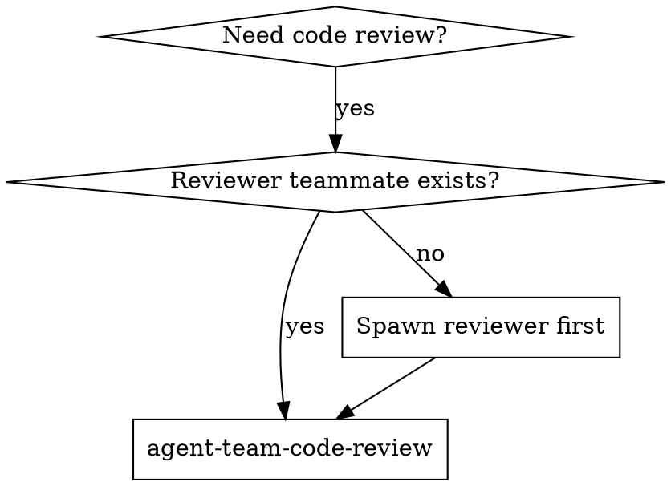

# Agent Team Code Review

Request code review from a persistent reviewer teammate who accumulates context across reviews.

**Core principle:** Review with context > review without context. A persistent reviewer catches cross-task patterns that ephemeral reviewers miss.

**Prerequisite:** `CLAUDE_CODE_EXPERIMENTAL_AGENT_TEAMS=1`

## When to Use



**Mandatory:**
- After each task in agent-team-driven-development
- After completing major feature
- Before merge to main

**Optional but valuable:**
- When stuck (reviewer has project context from prior reviews)
- Before refactoring (baseline check with historical awareness)
- After fixing complex bug

## Setting Up the Reviewer

### Option A: Reviewer Already Exists

If using agent-team-driven-development, the code-quality-reviewer teammate already exists. Send review requests to it directly.

### Option B: Spawn On-Demand

Spawn a reviewer teammate using the prompt template at `./reviewer-spawn-prompt.md`. Provide initial context about the project and what has been implemented so far.

## How to Request Review

**1. Get git SHAs:**
```bash
BASE_SHA=$(git rev-parse HEAD~1)  # or origin/main
HEAD_SHA=$(git rev-parse HEAD)
```

**2. Message the reviewer teammate with:**
- `WHAT_WAS_IMPLEMENTED` - What you just built
- `PLAN_OR_REQUIREMENTS` - What it should do
- `BASE_SHA` and `HEAD_SHA` - Git range to review
- `DESCRIPTION` - Brief summary
- Prior context references if applicable (e.g., "You reviewed Tasks 1-3 earlier. This is Task 4.")

**3. Act on feedback (reviewer responds via message):**
- Fix Critical issues immediately
- Fix Important issues before proceeding
- Note Minor issues for later
- Push back if reviewer is wrong (with reasoning, via message)

## What Persistent Review Adds

| Aspect | Ephemeral reviewer | Persistent reviewer (agent-team-code-review) |
|--------|---------------------|----------------------------------------------|
| Prior context | None | Accumulated across reviews |
| Pattern detection | Single review only | Cross-task patterns |
| Consistency | Each review independent | Consistent standards applied |
| Feedback quality | Generic | Specific to project conventions |
| Setup cost | Per-review dispatch | One-time spawn |

**A persistent reviewer can say things like:**
- "This has the same magic number issue I flagged in Task 2"
- "This pattern diverges from what you established in Task 1"
- "The progress reporting pattern I requested earlier is now applied correctly"

## Example

```
[Just completed Task 3: Add search functionality]

Lead messages reviewer teammate:
  Review Task 3 implementation.
  WHAT_WAS_IMPLEMENTED: Full-text search with filters
  PLAN_OR_REQUIREMENTS: Task 3 from docs/plans/feature-plan.md
  BASE_SHA: a7981ec
  HEAD_SHA: 3df7661
  DESCRIPTION: Added search() with 3 filter types
  Note: You reviewed Tasks 1-2 which set up the data model this builds on.

Reviewer teammate responds:
  Strengths: Clean query builder, consistent with Task 1 schema patterns
  Issues:
    Important: Missing input sanitization (same gap as Task 1 - now fixed there)
    Minor: Could reuse the validation helper from Task 2
  Cross-task: Pattern consistency is improving. Task 1 feedback was applied.
  Assessment: Ready with fixes

Lead sends issues to implementer teammate.
Implementer fixes.
Lead requests re-review.
Reviewer: Approved.
```

## Limitations

- Reviewer context window is independent (must send relevant info via message)
- `/resume` will NOT restore the reviewer teammate
- Reviewer cannot see Lead's context directly (all info via messages)

## Red Flags

**Never:**
- Skip review because "it's simple"
- Ignore Critical issues
- Proceed with unfixed Important issues
- Assume reviewer saw your code changes (send git range explicitly every time)
- Skip prior context references when they would help the reviewer

**If reviewer is wrong:**
- Push back with technical reasoning (via message)
- Show code/tests that prove it works
- Request clarification

## Integration

**Used by:**
- **superpowers-t:agent-team-driven-development** - Review after each task

**Principles:**
- Verify your work before claiming done — run tests, show evidence
- When receiving feedback, evaluate technically before implementing — don't blindly agree

See reviewer spawn template at: `agent-team-code-review/reviewer-spawn-prompt.md`
