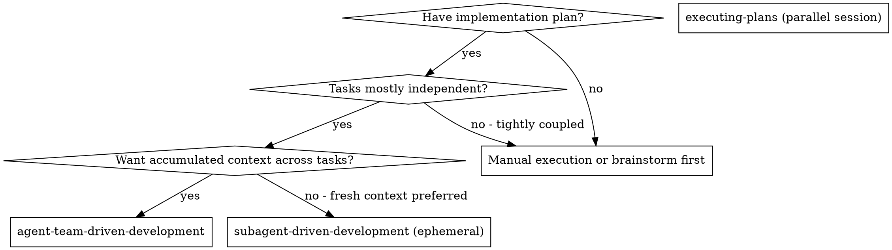
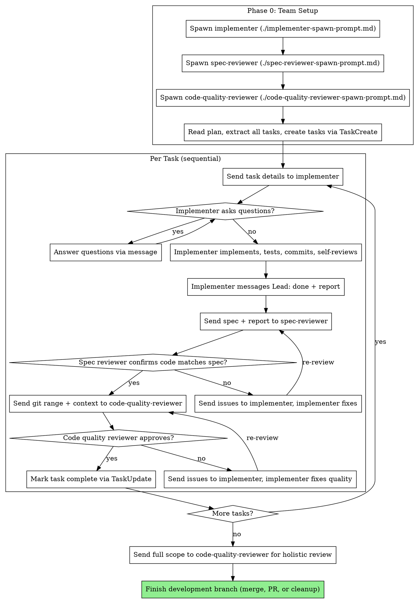

# Agent-Team-Driven Development

Execute plan by coordinating persistent Agent Teams teammates: implementer accumulates codebase understanding across tasks, reviewers retain memory of patterns. Lead coordinates only — all implementation goes through teammates.

**Core principle:** Persistent teammates + accumulated context + two-stage review (spec then quality) = higher quality than ephemeral subagents

**Prerequisite:** `CLAUDE_CODE_EXPERIMENTAL_AGENT_TEAMS=1`

## When to Use



**vs. subagent-driven-development (ephemeral):**
- Teammates persist, accumulating codebase understanding across all tasks
- Implementer retains context from earlier tasks (fewer re-reads)
- Reviewers remember prior feedback patterns (more consistent reviews)
- More resource-intensive (3 persistent context windows)

**vs. executing-plans (parallel session):**
- Same session (no context switch)
- Persistent teammates (not fresh per task)
- Two-stage review after each task

## The Process



## Prompt Templates

- `./implementer-spawn-prompt.md` - Spawn the implementer teammate
- `./spec-reviewer-spawn-prompt.md` - Spawn the spec compliance reviewer teammate
- `./code-quality-reviewer-spawn-prompt.md` - Spawn the code quality reviewer teammate

## Lead Role: Coordinate Only

**CRITICAL:** Lead coordinates and communicates but does NOT implement. All implementation is done by the implementer teammate.

Why: Prevents context pollution in Lead. Lead stays focused on coordination. The implementer accumulates implementation context intentionally while Lead stays clean for orchestration.

## Key Differences from Subagent Version

| Aspect | Subagent (ephemeral) | Agent Teams (persistent) |
|--------|---------------------|--------------------------|
| Lifecycle | Fresh per task | Persistent across all tasks |
| Context | Clean slate each time | Accumulated understanding |
| Communication | Dispatch/return | Bidirectional messaging |
| Task tracking | TodoWrite | TaskCreate/TaskUpdate |
| Lead role | Active controller | Coordinator only |
| Review quality | No prior context | Remembers earlier patterns |
| Cost | Per-invocation | 3 persistent context windows |

## Example Workflow

```
Lead: I'm using Agent-Team-Driven Development to execute this plan.

[Spawn implementer teammate with ./implementer-spawn-prompt.md]
[Spawn spec-reviewer teammate with ./spec-reviewer-spawn-prompt.md]
[Spawn code-quality-reviewer teammate with ./code-quality-reviewer-spawn-prompt.md]
[Read plan file, extract all 5 tasks, create TaskCreate for each]

Task 1: Hook installation script

Lead messages implementer:
  "Task 1: Hook installation script
   [full task text and context]
   Work from: ~/project"

Implementer messages Lead:
  "Before I begin - should the hook be installed at user or system level?"

Lead messages implementer:
  "User level (~/.config/superpowers/hooks/)"

Implementer messages Lead:
  "Done. Implemented install-hook command, 5/5 tests passing.
   Self-review: Found I missed --force flag, added it. Committed at abc123."

Lead messages spec-reviewer:
  "Review spec compliance for Task 1.
   Requirements: [full task text]
   Implementer claims: [implementer's report]"

Spec-reviewer messages Lead:
  "PASS - All requirements met, nothing extra."

Lead messages code-quality-reviewer:
  "Review code quality for Task 1.
   BASE_SHA: def456, HEAD_SHA: abc123
   Description: Hook installation command"

Code-quality-reviewer messages Lead:
  "Strengths: Good test coverage, clean.
   Issues: None. Approved."

[TaskUpdate: Task 1 complete]

Task 2: Recovery modes

Lead messages implementer:
  "Task 2: Recovery modes [full task text]
   Context: Builds on the hook system from Task 1 (you already know the codebase)."

[Implementer proceeds - no questions since it has context from Task 1]

Implementer messages Lead:
  "Done. Added verify/repair modes, 8/8 tests passing. Committed."

[Spec reviewer finds issues: missing progress reporting, extra --json flag]
[Implementer fixes]
[Spec reviewer re-reviews: PASS]
[Code quality reviewer finds magic number]
[Implementer extracts constant]
[Code quality reviewer re-reviews: Approved]

[TaskUpdate: Task 2 complete]

... [Tasks 3-5 follow same pattern, implementer gets faster with accumulated context]

[After all tasks]
Lead messages code-quality-reviewer:
  "Holistic review of entire implementation (Tasks 1-5). BASE_SHA: def456, HEAD_SHA: xyz789"

Code-quality-reviewer:
  "Cross-task review: Consistent patterns throughout. All requirements met.
   Ready to merge."

Lead: All tasks complete. Ready to merge/PR.
```

## Advantages

**vs. Manual execution:**
- Persistent implementer learns the codebase progressively
- Two-stage review catches issues systematically
- Coordination-only Lead keeps context clean

**vs. Subagent-driven-development (ephemeral):**
- Implementer doesn't re-read files already explored in earlier tasks
- Reviewers apply consistent standards (remember what they flagged before)
- Less total context loading across all tasks
- But: more resource-intensive (3 persistent context windows)

**Quality gates (same as ephemeral):**
- Self-review catches issues before handoff
- Two-stage review: spec compliance, then code quality
- Review loops ensure fixes actually work
- Spec compliance prevents over/under-building

## Limitations

- `/resume` will NOT restore teammates (Agent Teams limitation)
- No nested teams (teammates cannot spawn their own teams)
- One team per session
- Teammates have independent context windows (must send info via messages)

## Red Flags

**Never:**
- Start implementation on main/master branch without explicit user consent
- Skip reviews (spec compliance OR code quality)
- Proceed with unfixed issues
- Let Lead implement directly (Lead coordinates only, teammates implement)
- **Start code quality review before spec compliance is PASS** (wrong order)
- Move to next task while either review has open issues
- Assume teammates share context (they do NOT - send info via messages)
- Skip team setup phase (all 3 teammates must be spawned before work starts)
- Send implementer to next task before both reviews pass

**If implementer messages with questions:**
- Lead answers clearly and completely
- Provides additional context if needed
- Does not rush into implementation

**If reviewer finds issues:**
- Lead relays to implementer via message
- Implementer fixes
- Lead sends back to reviewer for re-review
- Repeat until approved
- Don't skip the re-review

## Prerequisites

- An implementation plan (written document with independent tasks)
- A git worktree or feature branch for isolation (recommended)

## Principles

- **TDD:** Implementer writes tests before implementation for each task
- **Evidence before claims:** Teammates verify their work before reporting done
- **Two-stage review:** Spec compliance first, code quality second — never skip either
