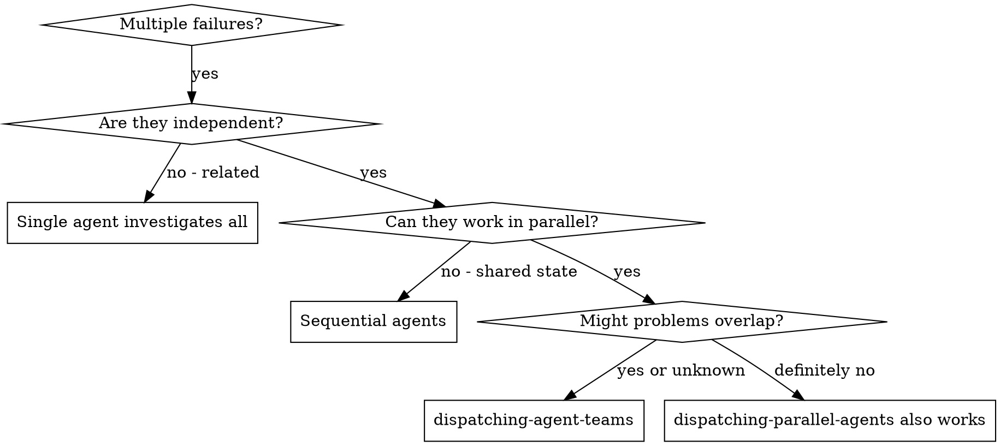
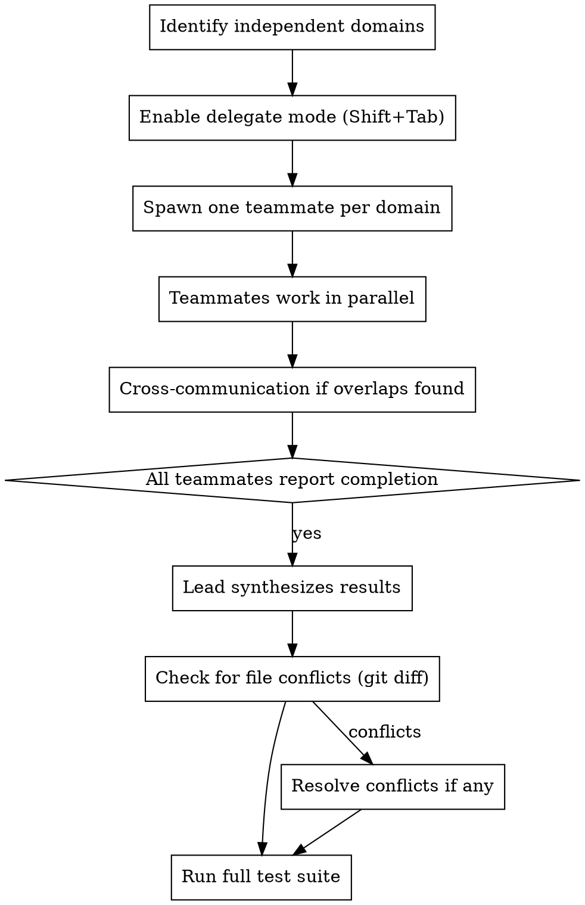

# Dispatching Agent Teams

Spawn one teammate per independent problem domain. Unlike ephemeral parallel agents, these teammates can communicate with each other when they discover overlapping concerns.

**Core principle:** One teammate per independent domain + cross-communication for discovered overlaps = parallel speed with coordination capability.

**Prerequisite:** `CLAUDE_CODE_EXPERIMENTAL_AGENT_TEAMS=1`

## When to Use



**Use when:**
- 3+ test files failing with different root causes
- Multiple subsystems broken independently
- Each problem can be understood without context from others
- Problems might share a root cause discovered during investigation

**Don't use when:**
- Failures are known to be related (investigate together first)
- Need to understand full system state
- Agents would edit same files (conflicts)
- Only 1-2 problems (not worth team overhead)

## The Process



### 1. Identify Independent Domains

Group failures by what's broken:
- Domain A: Tool approval flow
- Domain B: Batch completion behavior
- Domain C: Abort functionality

Each domain is independent - fixing one doesn't affect the others.

### 2. Enable Delegate Mode

Lead activates delegate mode (Shift+Tab). Lead coordinates and synthesizes but does NOT implement.

### 3. Spawn Teammates

One teammate per domain. Each spawn prompt includes:
- **Specific scope:** One test file or subsystem
- **Clear goal:** Make these tests pass / fix this subsystem
- **Constraints:** Do not modify files outside your domain
- **Communication protocol:** Message Lead with results. Message other teammates ONLY if you discover something that affects their domain.
- **Expected output:** Summary of root cause, changes made, cross-domain findings

### 4. Teammates Work in Parallel

All teammates work concurrently. The key difference from ephemeral agents:

**Cross-communication:** If Teammate A discovers the root cause also affects Teammate B's domain, Teammate A messages both Lead and Teammate B directly.

Example:
- Teammate A (fixing abort tests) discovers a timing bug in events.ts:42
- This timing bug might affect Teammate B's batch completion tests
- Teammate A messages Teammate B: "Found timing bug in events.ts:42 - check if this affects your batch completion investigation"
- Teammate B can adjust their approach immediately instead of rediscovering independently

### 5. Lead Synthesizes Results

When all teammates report completion:
1. Read each summary
2. Check for file edit conflicts (`git diff --stat`)
3. If conflicts: coordinate resolution via messaging
4. Run full test suite
5. Spot check: teammates can make systematic errors

## Spawn Prompt Template

For each teammate:

```
You are investigating [DOMAIN]. Your scope is [SPECIFIC FILES/TESTS].

Goal: [CLEAR OBJECTIVE]

Context:
[Error messages, test names, relevant background]

Constraints:
- Do not modify files outside [SCOPE]
- If you discover something affecting another domain, message the Lead
  AND the relevant teammate directly
- When complete, message Lead with your findings

Expected output:
- Root cause identified
- Changes made (files, what changed, why)
- Cross-domain findings (if any)
- Test results
```

## Example

```
Scenario: 6 test failures across 3 files after major refactoring

Lead identifies 3 independent domains:
- agent-tool-abort.test.ts: 3 failures (timing issues)
- batch-completion-behavior.test.ts: 2 failures (tools not executing)
- tool-approval-race-conditions.test.ts: 1 failure (execution count = 0)

Lead enables delegate mode (Shift+Tab)

Lead spawns 3 teammates:
  Teammate "abort-fixer" -> Fix agent-tool-abort.test.ts
  Teammate "batch-fixer" -> Fix batch-completion-behavior.test.ts
  Teammate "race-fixer"  -> Fix tool-approval-race-conditions.test.ts

[All three work concurrently]

abort-fixer messages batch-fixer:
  "Found that the event dispatch in events.ts uses wrong threadId
  field name. This might affect your batch completion events too."

batch-fixer:
  "Confirmed - same root cause for my failures. I'll use the
  corrected field name. Thanks."

Results:
- abort-fixer: Replaced timeouts with event-based waiting
- batch-fixer: Fixed event structure bug (shared root cause with abort-fixer)
- race-fixer: Added wait for async tool execution

Lead: All fixes independent at file level, no conflicts. Full suite green.
```

## Common Mistakes

**Too broad scope:** "Fix all the tests" - teammate gets lost
**Correct:** "Fix agent-tool-abort.test.ts" - focused scope

**No cross-communication protocol:** Teammates discover overlaps but don't share
**Correct:** Explicit instruction to message other teammates when finding overlaps

**Lead implements instead of coordinating:** Defeats delegation purpose
**Correct:** Lead stays in delegate mode, only synthesizes

**No conflict check after parallel work:** Teammates may edit adjacent code
**Correct:** Lead runs `git diff --stat` to verify no conflicts

**Too many teammates:** 6+ teammates creates coordination overhead
**Correct:** 3-4 teammates is the sweet spot

## Red Flags

**Never:**
- Spawn teammates for related problems (investigate together first)
- Skip conflict verification after parallel work
- Let Lead implement directly (delegate mode)
- Ignore cross-domain findings from teammates
- Proceed without running full test suite after integration
- Spawn teammates that would edit the same files

## Integration

**Pairs with:**
- **superpowers:systematic-debugging** - Each teammate can use this for their domain
- **superpowers:verification-before-completion** - Each teammate verifies before reporting

**Ephemeral alternative:**
- **superpowers:dispatching-parallel-agents** - Use when Agent Teams is not enabled or problems definitely don't overlap
